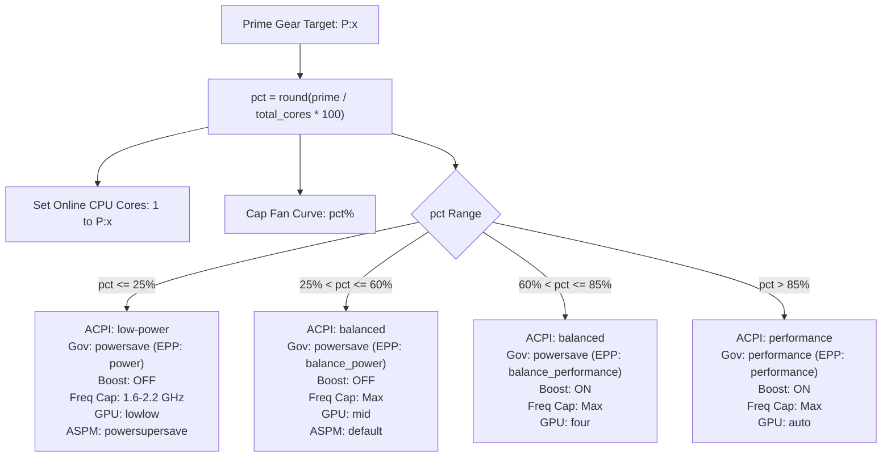

# AGENTS.md — ChangeState Developer & Agent Guide

> **Core Purpose:** `changestate` provides discrete prime-core stepping and proportional hardware power / thermal / acoustic profiling for Linux systems (supporting AMD & Intel CPUs, Radeon & NVIDIA GPUs, and Lenovo EC platforms).

---

## 1. System Architecture & Core Concepts

### 1.1 The "1, 2, 5 Law" and Prime Number Core Allocation
- **Prime Allocations (`P:2, P:3, P:5, P:7, P:11, ...`):**
  - Allocating physical cores by prime numbers avoids thread contention on shared cache hierarchies and breaks harmonic resonance with standard power-of-two thread pools (2, 4, 8, 16) commonly used in I/O queues and hash rings.
  - Dynamically hotplugs CPU cores via Linux sysfs: Core 0 is permanently pinned online; cores `1` through `N-1` are controlled via `/sys/devices/system/cpu/cpu*/online`.
- **Dynamic Tier Capacity Proportions:**
  - Hardware capacity percentage is calculated as `pct = round((prime_count / total_threads) * 100)`.
  - Governor, EPP (Energy Performance Preference), ACPI platform profiles, CPU boost, frequency caps, GPU dynamic power management (DPM), and fan limits step progressively based on `pct`.

### 1.2 Hardware Subsystems Controlled
| Subsystem | Linux / Hardware Interface | Controlled Behavior |
| :--- | :--- | :--- |
| **CPU Core Hotplug** | `/sys/devices/system/cpu/cpu*/online` | Cores online from 1 up to `prime_count` |
| **ACPI Platform Profile** | `/sys/firmware/acpi/platform_profile` | `low-power`, `balanced`, `performance` |
| **CPU Governor & EPP** | `/sys/devices/system/cpu/cpufreq/policy*/scaling_governor`, `energy_performance_preference` | `powersave` / `performance` with EPP (`power`, `balance_power`, `balance_performance`, `performance`) |
| **CPU Turbo / Boost** | Intel: `/sys/devices/system/cpu/intel_pstate/no_turbo`<br>AMD: `/sys/devices/system/cpu/cpufreq/boost` | Enabled or disabled across Intel/AMD architectures |
| **CPU Max Frequency** | `/sys/devices/system/cpu/cpufreq/policy*/scaling_max_freq` | Frequency caps (e.g. 1.6 GHz, 2.2 GHz) or hardware maximum |
| **GPU Power Profile** | AMD: `/sys/class/drm/card*/device/power_dpm_force_performance_level`<br>NVIDIA: `nvidia-smi` power limits & clock locking | Scaled according to percentage tiers (`lowlow`, `mid`, `four`, `auto`) |
| **Fans & Acoustics** | 1. Lenovo EC: `/sys/devices/pci*/**/VPC2004:00/fan_mode`<br>2. ACPI Cooling: `/sys/class/thermal/cooling_device*` (`cur_state`)<br>3. NVIDIA: `nvidia-smi --set-gpu-fan-speed` | Fan speeds and thermal trip thresholds proportionally capped to prime percentage capacity |
| **Radios & Peripherals** | `rfkill`, `/sys/devices/pci*/**/VPC2004:00/camera_power`, ALSA `amixer` | Wi-Fi toggle, Bluetooth block/unblock, hardware camera cut, mic mute |
| **PCIe ASPM & Audio** | `/sys/module/pcie_aspm/parameters/policy`, `/sys/module/snd_hda_intel/parameters/power_save` | `powersupersave` below 30% capacity; audio codec sleep |
| **Keyboard Backlight** | `/sys/class/leds/platform::kbd_backlight/brightness` | Locked at max across all states |

---

## 2. Codebase Map & Component Index

```
changestate-repo/
├── changestate                       # Main CLI & engine (Python 3 executable)
├── telemetry_logger.py               # Background telemetry agent & JSONL metric recorder
├── changestate-*.desktop             # FreeDesktop application shortcuts (pkexec wrappers)
├── cinnamon-applet/                  # Desktop environment integration
│   └── changestate@telosdevgroup/
│       ├── applet.js                 # Cinnamon panel applet with slider and status badge
│       ├── metadata.json             # Applet metadata (UUID: changestate@telosdevgroup)
│       └── settings-schema.json      # User settings (e.g., auto terminal spawn)
├── README.md                         # Public documentation and hardware theory
└── AGENTS.md                         # (This document) Engineering blueprint for AI agents
```

### Component Details
1. **[`changestate`](file:///home/dev/Code/changestate-repo/changestate):**
   - Single-file executable CLI (no external Python dependencies required).
   - Dynamically calculates prime tiers up to the total core count using [`get_prime_tiers()`](file:///home/dev/Code/changestate-repo/changestate#L218-L225).
   - Writes active state to `/var/run/changestate.state` and automatically records state-shift telemetry to `/var/log/changestate_telemetry.jsonl`.
   - Spawns optional notification alerts via `notify-send`.
   - Supports user terminal launch on gear shift if `--terminal`, `-t`, `CHANGESTATE_TERMINAL=1`, or user config setting is set.

2. **[`telemetry_logger.py`](file:///home/dev/Code/changestate-repo/telemetry_logger.py):**
   - High-density telemetry collector.
   - Monitors CPU load (`/proc/stat`), per-core frequencies, CPU/GPU/NVMe thermals (`hwmon`), GPU power draw, battery percentage/status, and local web latency (default probe on port 8006).
   - Supports single-shot inspection via `--once` or continuous recording to `/var/log/changestate/telemetry.jsonl` (with fallback to `~/changestate-telemetry.jsonl`).

3. **[`cinnamon-applet/changestate@telosdevgroup`](file:///home/dev/Code/changestate-repo/cinnamon-applet/changestate@telosdevgroup):**
   - Cinnamon Desktop Extension written in GObject-introspected JavaScript (`applet.js`).
   - Watches `/var/run/changestate.state` on a 2-second tick.
   - Features a continuous popup slider mapped to discrete `PRIME_STEPS` (`p2` to `p31`).
   - Launches `pkexec /home/dev/Code/changestate <gear>` asynchronously on slider release.

---

## 3. State Hierarchy & Threshold Mapping

In [`apply_prime(prime_count)`](file:///home/dev/Code/changestate-repo/changestate#L226-L280), hardware parameters are stepped according to capacity percentage:



---

## 4. Key Developer & Agent Workflows

### 4.1 Running and Testing
- **Display Available Prime Gears & Hardware Status:**
  ```bash
  python3 /home/dev/Code/changestate-repo/changestate --help
  python3 /home/dev/Code/changestate-repo/changestate status
  ```
- **Executing a Gear Shift (Requires Root Privileges):**
  ```bash
  sudo /home/dev/Code/changestate-repo/changestate p5
  sudo /home/dev/Code/changestate-repo/changestate p11
  # With terminal spawn
  sudo /home/dev/Code/changestate-repo/changestate p7 --terminal
  ```
- **Taking a Single Telemetry Snapshot:**
  ```bash
  python3 /home/dev/Code/changestate-repo/telemetry_logger.py --once
  ```

### 4.2 Cinnamon Applet Development & Installation
- Applet location on system: `~/.local/share/cinnamon/applets/changestate@telosdevgroup/`
- Sync changes to the active desktop environment:
  ```bash
  cp -r /home/dev/Code/changestate-repo/cinnamon-applet/changestate@telosdevgroup ~/.local/share/cinnamon/applets/
  # Restart Cinnamon panel (or press Alt+F2 -> r -> Enter in X11)
  cinnamon --replace &
  ```

---

## 5. Development Principles & Guardrails for Future AI Agents

When modifying or extending this codebase, adhere strictly to these rules:

1. **Preserve Fallbacks for Multi-Vendor Hardware:**
   - Always guard sysfs and vendor-specific paths with `glob.glob()`, `os.path.exists()`, or `try/except`.
   - Never assume Intel or AMD: use [`is_intel_cpu()`](file:///home/dev/Code/changestate-repo/changestate#L36-L38) or inspect sysfs paths dynamically.
   - Never assume discrete GPU presence: check [`has_nvidia_gpu()`](file:///home/dev/Code/changestate-repo/changestate#L40-L44) before running `nvidia-smi`.
2. **Never Take CPU Core 0 Offline:**
   - Linux sysfs will reject or destabilize kernel timers if CPU 0 is offlined. Hotplugging logic must always iterate over cores `1` to `total-1`.
3. **Graceful Permission Failures:**
   - When writing to sysfs, prefer opening directly and fall back to `echo <val> | sudo tee <path>` if encountering `PermissionError`.
   - Ignore `EBUSY` (errno 16) when adjusting cooling device limits or device nodes in transition.
4. **Preserve Persistent Utilities & AI Assistant:**
   - Antigravity AI assistant, core network connections, and keyboard backlight must never be severed in low-power modes.
5. **Format Telemetry as Single-Line Valid JSON:**
   - `telemetry_logger.py` and `collect_telemetry_snapshot` must emit strict JSON lines (one JSON per line) to maintain compatibility with downstream log ingestors and AI metric analysis pipelines.
6. **Synchronize Applet & Engine:**
   - Any modifications to the gear naming or calling conventions in [`changestate`](file:///home/dev/Code/changestate-repo/changestate) must be mirrored in [`cinnamon-applet/.../applet.js`](file:///home/dev/Code/changestate-repo/cinnamon-applet/changestate@telosdevgroup/applet.js) and the `.desktop` launchers.
