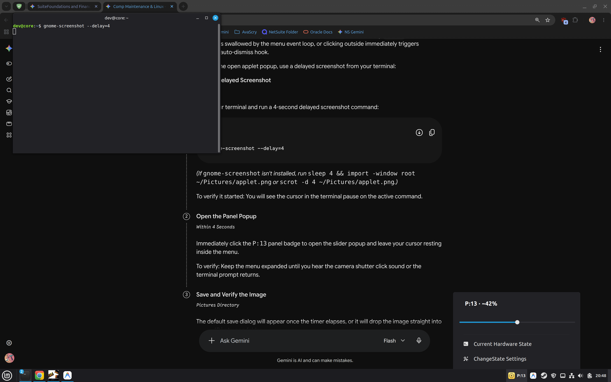

# ChangeState

**Elastic Capacity Controller — Dynamic Hardware Resource Scaling for Linux**

`changestate` is an unbloated, proportional hardware governor and native Linux Mint / Cinnamon panel applet. It auto-discovers your machine's hardware capabilities and maps overall system throughput to standardized prime capacity tiers (`P:2` through `P:31`), coordinating active CPU cores, clock ceilings, GPU frequencies, and memory caches with a single slider.

---

## Visual Interface & Terminal Status

### Native Cinnamon Panel Applet
Continuous capacity slider, real-time tier badge, and hardware diagnostic readout:



### ASCII Terminal Status Readout
Instant hardware telemetry and capacity state inspected via `changestate status`:

```text
================================================================
  CHANGESTATE  •  Active Level: P:13 (~42% Capacity)
  [██████████░░░░░░░░░░░░░░] ~42%
================================================================
CPU (Processor):
  • Active Cores   : 13 of 32 cores running (19 powered down asleep)
  • Speed Ceiling  : 1203 MHz (Clamped from factory 2200 MHz to stop heat)
  • Turbo Boost    : Off (Enforced - stops sudden fan spikes)

GPU (Graphics):
  • Real-Time Draw : 20.72 W (Running at 270 MHz)
  • Power Ceiling  : Factory 115W base, dynamic boost spikes clamped

Memory & Cooling:
  • Swappiness     : 6 (Keeps active data in RAM, avoids disk thrash)
  • Cooling Fans   : BIOS Automatic (Quiet baseline, safe thermal curve)
  • Battery        : 97% (Not charging)
================================================================
```

---

## Quick One-Liner Installation

Install the ChangeState CLI to `/usr/local/bin/changestate` and register the Cinnamon desktop applet with a single command:

```bash
curl -sSL https://raw.githubusercontent.com/telosdevgroup/changestate/main/install.sh | bash
```

*(The script symlinks/copies the applet to `~/.local/share/cinnamon/applets/changestate@avathings.com` and installs the CLI to `/usr/local/bin/changestate`.)*

---

## Universal Prime Capacity Reference Table ($P:2 \dots P:31$)

Every prime gear corresponds to a calibrated universal capacity ratio that dynamically dictates active cores, clock limits, and power targets:

| Prime Tier | Universal % | Active Cores (8-Thread Rig) | Active Cores (16-Thread Laptop) | Active Cores (32-Thread Workstation) | Subsystem Profile & Behavior |
| :--- | :---: | :---: | :---: | :---: | :--- |
| **`P:2`** | **6%** | 1 core | 1 core | 2 cores | Minimum floor capacity, extreme battery sipping. Codec power save, low-power ACPI profile. |
| **`P:3`** | **10%** | 1 core | 2 cores | 3 cores | Ultra-light background terminal, sensor monitoring, minimal background thermal footprint. |
| **`P:5`** | **16%** | 1 core | 3 cores | 5 cores | Quiet browsing and light documentation reading without cooling fan spinup. |
| **`P:7`** | **23%** | 2 cores | 4 cores | 7 cores | Smooth typing, background audio playback, completely cool thermals. |
| **`P:11`** | **35%** | 3 cores | 6 cores | 11 cores | Whispering cool server operation & steady background local LLM inferencing. |
| **`P:13`** | **42%** | 3 cores | 7 cores | 13 cores | Steady development workflow, clean responsive editor, balanced battery drain. |
| **`P:17`** | **55%** | 4 cores | 9 cores | 18 cores | Multi-service containers, active compiling, fluid desktop responsiveness. |
| **`P:19`** | **61%** | 5 cores | 10 cores | 20 cores | Heavy local developer builds with concurrent IDE and browser multitasking. |
| **`P:23`** | **75%** | 6 cores | 12 cores | 24 cores | **The Balanced Sweet Spot** — Full gaming & heavy development with zero fan panic loops. |
| **`P:29`** | **93%** | 7 cores | 15 cores | 30 cores | High-throughput data ingestion, fast local compilation, and heavy batch runs. |
| **`P:31`** | **100%** | 8 cores | 16 cores | 32 cores | **Full Throttle** — All clamps released, uncapped factory turbo boost, and maximum GPU TGP. |

---

## The Philosophy: Elastic Scaling without Auto-Boost Chaos

Modern laptop processors and GPUs are tuned aggressively out of the box—frequently triggering 5.5 GHz micro-bursts for trivial background tasks, drawing triple their baseline wattage, and sending cooling fans into audible panic loops.

`changestate` eliminates this behavior with clear, deterministic principles:

1. **Pure Dynamic Auto-Discovery (Zero Hardcoded Topology)**:
   - Probes the host system dynamically on launch:
     - CPU logical thread topology (`/sys/devices/system/cpu/cpu[0-9]*`)
     - Physical CPU frequency ranges (`cpuinfo_min_freq` to `cpuinfo_max_freq`)
     - Total RAM and Swap capacity (`/proc/meminfo`)
     - GPU hardware clocks and power bounds via driver sysfs / `nvidia-smi`
   - Dynamically scales active online cores to host topology:
     $$\text{Active Cores} = \max\left(1, \min\left(\text{round}\left(\frac{\text{Capacity \%}}{100} \times \text{Total Threads}\right), \text{Total Threads}\right)\right)$$

2. **The 80% Silicon Safety Ceiling & Turbo Clamp**:
   - On sub-100% tiers (`P:2` through `P:29`), clocks scale smoothly across the range:
     $$\text{Target Clock} = \text{Min} + \left(\frac{\text{Capacity \%}}{100}\right) \times \left(0.80 \times \text{Max} - \text{Min}\right)$$
   - Turbo Boost and dynamic GPU boosts are strictly disabled across intermediate tiers to eliminate sudden thermal spikes.
   - At `P:31` (100%), all clamps are released: full turbo boost enabled, uncapped clock limits, and factory GPU TGP.

3. **BIOS Thermal Safety Preserved**:
   - Cooling fans remain governed by hardware automatic ACPI curves. Because clock and voltage spikes are eliminated on intermediate tiers, the system purrs quietly without any risk of stalling fans or overheating.

4. **Session & Process Protection**:
   - Core 0 is permanently pinned online to guarantee kernel timer stability. Background services (such as local LLM inference engines and databases) remain fully intact across capacity transitions.

---

## Command Line Usage

Inspect hardware specs, discovered tiers, or current active levels:
```bash
# View discovered specs and available capacity tiers
changestate

# Check current active hardware state
changestate status

# Scale to a capacity tier (requires sudo/pkexec)
sudo changestate p11
sudo changestate p23
sudo changestate p31
```

---

## Licensing: The Honorable Dual Model

ChangeState is built with zero DRM, zero activation keys, zero telemetry, and zero nag screens. The codebase is 100% identical for everyone. We operate under a transparent, fair-use honor system:

```
┌───────────────────────────────────────┬───────────────────────────────────────┐
│              PERSONAL                 │              COMMERCIAL               │
├───────────────────────────────────────┼───────────────────────────────────────┤
│ For personal laptops, rigs, & labs.   │ For corporate & commercial hardware.  │
│                                       │                                       │
│ Free & Open (Voluntary Tip Jar)       │ $25 / seat (One-time flat fee)        │
│ [ Drop a Tip ($1 - $5) ]              │ [ Purchase Commercial Registration ]  │
│                                       │ Includes instant tax invoice & PDF    │
└───────────────────────────────────────┴───────────────────────────────────────┘
```

- **Personal Use**: 100% free and open for individual rigs, hobbyists, students, and home labs. If it saved your laptop battery or kept your workspace quiet, voluntary contributions can be dropped into the [Personal Tip Jar](https://avathings.com/changestate#tip).
- **Commercial Use**: If you or your team use ChangeState on hardware owned, leased, or reimbursed by a commercial entity, please support ongoing development by purchasing a [Commercial Seat ($25 flat / seat)](https://avathings.com/changestate#commercial). Checkout automatically generates an official tax invoice and downloadable PDF license certificate for corporate expense accounting.
